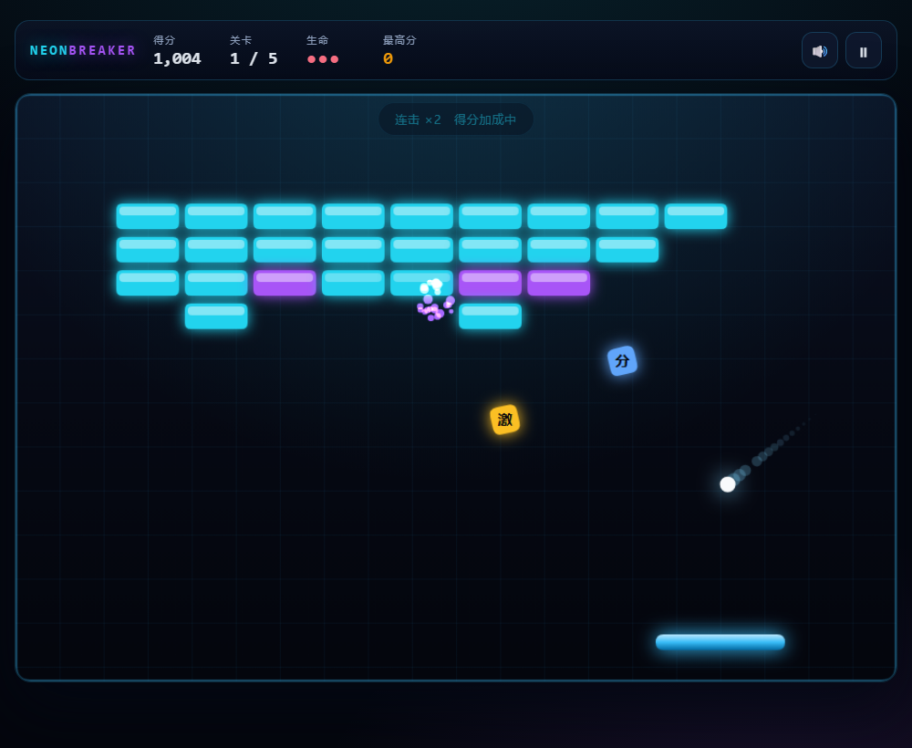

# 霓虹打砖块 · NEON BREAKER

一个用原生 HTML / CSS / JavaScript 写的霓虹风打砖块小游戏。**零依赖、零构建**，双击 `index.html` 就能玩，也可以直接部署到 GitHub Pages。



## 特性

- **纯原生实现**：没有框架、没有 npm 依赖、没有打包步骤，源码即产物。
- **手写物理**：圆与矩形的精确碰撞、分步推进防穿模、按击球位置控制反弹角。
- **5 个手工设计的关卡**：金字塔、棋盘、钢铁堡垒……含不可破坏的钢砖。
- **5 种道具**：加宽挡板、分裂球、时间减速、额外生命、激光炮。
- **本地双人对战**：同一块键盘，上下各守一端，共享中间砖墙。砖块得分算给最后击球的人，谁先把对手的命打光谁赢。
- **连击计分**：短时间内连续击碎砖块，得分倍率最高 3 倍。
- **手感细节**：粒子爆炸、屏幕震动、球体拖尾、受伤砖块的白闪反馈。
- **程序化音效**：用 Web Audio API 现场合成，不加载任何音频文件。
- **本地存档**：最高分与音效开关保存在 `localStorage`。
- **鼠标 / 触摸 / 键盘**三种操作方式，适配移动端。

## 快速开始

### 方式一：直接打开

双击 `index.html` 即可。项目刻意使用传统 `<script>` 标签而不是 ES Module，就是为了让 `file://` 协议下也能直接运行。

### 方式二：本地服务器

```bash
npm start
# 霓虹打砖块已启动 → http://127.0.0.1:5173
```

这个命令跑的是 `tools/serve.js`，一个零依赖的静态服务器。想在手机上也试玩，可以用 `HOST=0.0.0.0 npm start`，然后用同一局域网下的手机访问电脑 IP。

## 操作说明

| 操作 | 说明 |
| --- | --- |
| 移动鼠标 / 手指滑动 | 移动挡板 |
| `←` `→` 或 `A` `D` | 键盘移动挡板 |
| `空格` / `Enter` / 点击画面 | 发球、发射激光 |
| `P` / `Esc` | 暂停与继续 |
| `M` | 音效开关 |

手感小技巧：球打在挡板**两侧**时反弹角更大，打在正中间则接近垂直。用两侧击球可以把球甩到你想打的区域。

### 本地双人对战

菜单里点「本地双人对战」就能开一局。两名玩家各守场地一端，中间是双方共享的砖墙：

| 操作 | 说明 |
| --- | --- |
| P1（下方，蓝色挡板） | `A` `D` 或鼠标 / 触摸移动 |
| P2（上方，粉色挡板） | `←` `→` |
| 发球 / 发射激光 | `空格`（P1）、`Enter`（P2） |
| 暂停 / 静音 | `P` `M`（两端通用） |

规则：

- 每人 **3 条命**，球从自己这端飞出去就扣一条，然后由漏球的一方发球。
- 砖块得分**算给最后击球的玩家**，所以既要接得住球、又要打得刁钻。
- 道具会从砖块处**朝上下两侧各掉一个**，双方机会均等；减速是全局效果，两边一起慢。
- 砖墙清空就进入下一关，比分继续累积——对战没有终点，直到一方命耗尽。

打完一局后，结算界面的按钮可以直接再来一局，也可以切回单人闯关。

## 道具一览

| 图标 | 名称 | 效果 |
| --- | --- | --- |
| 宽 | 加宽挡板 | 挡板变宽，持续 11 秒 |
| 分 | 分裂球 | 每个球额外分裂出一个，最多同时 8 个球 |
| 慢 | 时间减速 | 球速降到 68%，持续 11 秒 |
| 命 | 额外生命 | 生命数 +1 |
| 激 | 激光就绪 | 9 秒内按空格可以从挡板两端发射激光 |

砖块被击碎时有 24% 的概率掉落道具，接住即可生效。掉落的道具没接住会消失。

## 目录结构

```
.
├── index.html              # 页面结构：HUD + 画布 + 弹窗
├── styles/
│   └── main.css            # 全部样式（画布只画游戏画面，界面用 DOM）
├── src/
│   ├── utils.js            # 数学与几何工具（碰撞检测、加权随机等）
│   ├── config.js           # 所有可调参数集中在这里
│   ├── levels.js           # 关卡地图，用字符画描述
│   ├── storage.js          # 最高分与设置的持久化
│   ├── audio.js            # Web Audio 程序化音效
│   ├── particles.js        # 粒子系统
│   ├── entities.js         # 挡板 / 球 / 砖块 / 道具
│   ├── input.js            # 鼠标、触摸、键盘的统一输入层
│   ├── game.js             # 状态机、物理、计分与渲染
│   └── main.js             # 页面装配与主循环
├── tools/
│   ├── serve.js            # 零依赖本地静态服务器
│   └── smoke-test.js       # 无头冒烟测试
└── docs/                   # 项目截图
```

## 测试

```bash
npm test
```

`tools/smoke-test.js` 会搭一套最小的假浏览器环境（假的 DOM / Canvas / localStorage）加载全部脚本，然后像真人一样驱动游戏：

```
  ✓ 每一关的地图行宽都与砖块列数一致  （列数 = 12）
  ✓ 点击开始后进入待发球状态  （ready）
  ✓ 挡板追球能真正打碎砖块  （得分 11821）
  ✓ 可以推进关卡（AI 接球下通关）  （推进 2 关，当前第 3 关 / 状态 playing）
  ✓ 漏球会扣掉一条命
  ✓ 生命耗尽后进入结算界面  （gameover）
```

不需要装任何浏览器或测试框架，在没有图形界面的环境里也能跑。

测试里会把随机数发生器换成固定种子（`NB.Utils.setRandom`），所以每次运行的过程和结果完全一致，不会偶发翻车。

## 部署到 GitHub Pages

项目是纯静态的，不需要任何构建步骤。

1. 在 GitHub 上新建一个仓库（建议名字就叫 `neon-breaker`），**不要**勾选自动生成 README。
2. 本地关联远程仓库并推送：

   ```bash
   git remote add origin git@github.com:<你的用户名>/neon-breaker.git
   git push -u origin main
   ```

3. 打开仓库的 **Settings → Pages**。
4. 在 *Build and deployment* 里把 **Source** 选成 `Deploy from a branch`，**Branch** 选 `main`、目录选 `/ (root)`，保存。
5. 等一两分钟，访问 `https://<你的用户名>.github.io/neon-breaker/` 即可。

## 二次开发

**调整手感**：几乎所有数值都集中在 `src/config.js`，比如球的初速、挡板宽度、道具掉落率，改完刷新页面就生效。

**新增关卡**：编辑 `src/levels.js`，每个字符代表一块砖：

| 字符 | 含义 |
| --- | --- |
| `.` | 空位 |
| `1` `2` `3` | 需要击打 1 / 2 / 3 次才会碎 |
| `X` | 不可破坏的钢砖 |

每行 12 个字符，往数组里追加一个 `{ name, rows }` 对象就是新的一关。冒烟测试会自动校验行宽。

**调试**：浏览器控制台里输入 `NB.game` 可以直接查看和修改当前对局，例如 `NB.game.lives = 99`。

## 后续计划

- [ ] 加入关卡编辑器
- [x] 支持本地双人对战（上下分守、镜像道具、得分归属与胜负判定）
- [x] 补充 GitHub Actions 自动跑冒烟测试（`.github/workflows/ci.yml`，每次推送到 `main` 和每个 PR 都会执行 `npm test`）

## 许可

[MIT](LICENSE)
